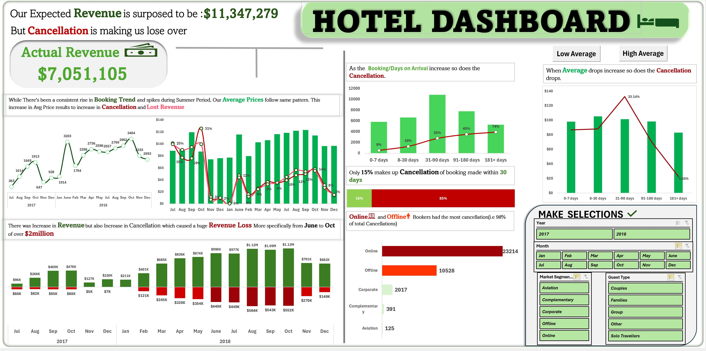
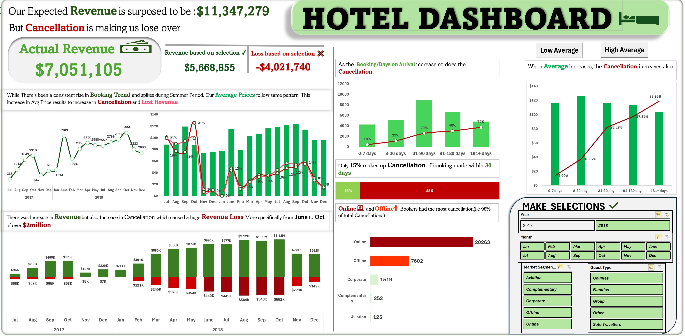

# **HOTEL REVENUE AND CANCELLATION ANALYSIS** 
---
## **Project Overview**
This project analyzes hotel booking data to uncover key trends, address revenue loss caused by cancellations, and improve decision-making for hotel management. The interactive dashboard highlights critical insights, such as the relationship between lead time, cancellation rates, and revenue impact.


---
**_Disclaimer_** _the dataset does not represent any company, institution or country as it was gotten from [kaggle](https://www.kaggle.com/datasets/ahsan81/hotel-reservations-classification-dataset?resource=download) 
----
## **Scope of the Project**
This dashboard focuses on analyzing these key attributes:
- **Revenue trends**: Actual vs. expected revenue.
- **Cancellations**: How cancellations impact revenue and what drives them.
- **Booking patterns**: Trends based on booking lead times, average prices, and market segments.
- others includes guest counts, lead time e.t.c
  
 ### **Dataset** :
* Contains hotel booking details for 2017 and 2018 [data](Hotel_Reservations.csv) gotten from Kaggle.
 
 ### 🎯**Goal**
* To identify patterns contributing to revenue loss, particularly cancellations, and suggest actionable strategies to optimize hotel operations.
---
## Data Cleaning and Preparation
1. **Cleaning Steps**:
  * Removed duplicates and null values where necessary
  * Standardized date formats and ensured consistent data types across all columns.
2. **Transformation**:
  - Calculated **cancellation rates** based on booking timelines.
  - Derived metrics like **expected revenue**, **actual revenue**, and **revenue lost**.

3. **Feature Engineering**:
* Created new columns to enhance analysis:
   * Guest Type: Categorized bookings based on guest count:
    ``` 
  =IF(AND(no_of_adult=1,no_of_children=0),"SoloTravellers",IF(AND(no_of_adult=2,no_of_children=0),"Couples",IF(AND(no_of_adult>=1,no_of_children>=1),"Families",IF(AND(no_of_adult>2,no_of_children>=0),"Group","Other"))))
    ```

 * Lead Time Category: Grouped lead times into meaningful ranges for analysis:
    ```
    =IF(LeadTime<=7, "0-7 days", IF(LeadTime<=30, "8-30 days", IF(LeadTime<=90, "31-90 days", IF(LeadTime<=180, "91-180 days", "181+ days"))))
    ```

  * Cancellation Rate: Computed the percentage of cancellations for each lead time category.
---
## 📊**Dashboard Features and Design**
### **Key Features**
1. **Interactive Slicers**:
   - Select **Year**, **Month**, **Market Segment**, and **Guest Type** to dynamically adjust the displayed data.
   - Real-time updates of key metrics such as:
     - **Revenue based on Selection**
     - **Loss based on Selection**
       
       Full Dashboard without Selection            |        Full Dashboard without Selection
       :-------------------------------------:     | :------------------------------------:
          |       
       _**Notice the middle left of both diagrams**_
       

2. **Actionable Insights**:
   - Revenue Analysis(i.e Expected revenue, actual revenue, and loss due to cancellations.)
   - Analyze how cancellations impact revenue.
   - Booking Patterns, Trends over time, including seasonal spikes in bookings and cancellations.
   - Observe patterns in booking timelines, pricing, and their influence on cancellations.

3. **Visualizations**:
   - Line and bar charts to display trends.
   - Clear distinction between **revenue earned** (green) and **revenue lost** (red).
     
4. **Guest Type Breakdown**:
    - Categorized guest behavior to identify the most profitable segments.
---

  ##  💡**Key Insights**
1. **Revenue Trends**:
   - Expected revenue: **$11,347,279**.
   - Actual revenue: **$7,051,105**.
   - Total loss due to cancellations: **$4,170,324**.

2. **Cancellation Patterns**:
   - Cancellations contribute to a revenue loss of over $4 million, especially for bookings made more than 180 days in advance in context:
     - **74%** cancellation rate for bookings made more than **181 days in advance** and Guests booking closer to their stay (0–30 days) are less likely to cancel.

3. **Booking Channels**:
   - **Online bookings** contribute to the majority of cancellations, with **21,609 cancellations**, accounting  for 98% of total cancellations with **offline bookings** included.
---
## 🔍 **Insights and Recommendations**
1. **Mitigating Cancellations**:
  * Introduce non-refundable discounts or flexible cancellation policies for long lead times.
2. **Revenue Optimization**:
  * Analyze pricing strategies to stabilize average room prices during peak periods.
3. **Targeted Marketing**:
  * Focus on online and offline segments with high cancellation rates by offering incentives like loyalty discounts.
---

## **Tools Used**
* Excel: Data cleaning, transformations, and dashboard creation.
* Formulas: Dynamic categorization (e.g., Guest Type, Lead Time Category e.t.c).

## **Contact**
Feel free to connect with me on [LinkedIn](https://www.linkedin.com/in/peter-junior-nwachineke-819291247/) for more details or collaborations!
